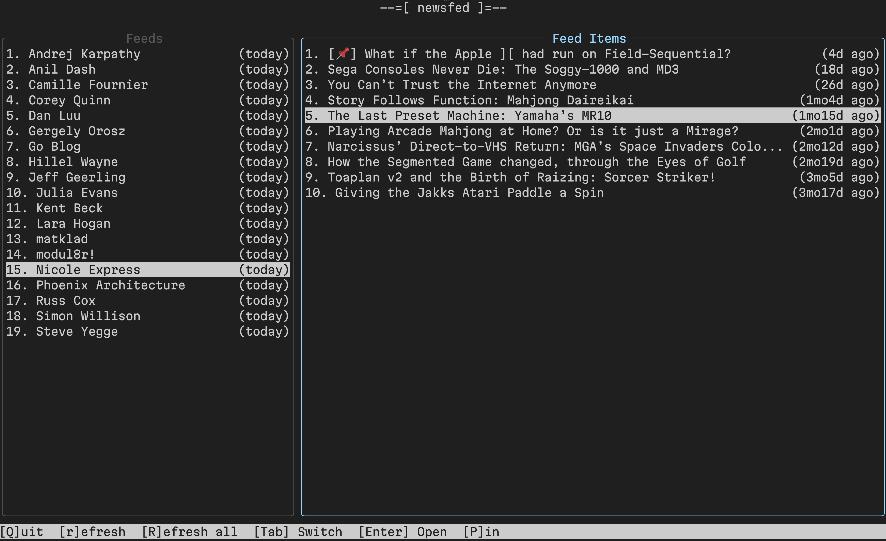

# newsfed

Newsfed is a small, terminal-based tool that tracks news feeds (RSS and Atom)
or websites-that-look-like-news-feeds for updates. All of its metadata and
news items are saved to the computer that runs newsfed.

Newsfed offers both a text user interface (TUI) and plain command-line
interface (CLI). You should most likely use the TUI.

## Installation

You can install newsfed by cloning the repository and running:

```bash
# If you have `just` installed
just build

# If you don't have `just` installed
go build -o dist/newsfed ./cmd/newsfed
```

Before you can use newsfed, you must first initialize it:

```bash
newsfed init
```

This command will create:

- `~/.newsfed/config.yaml`, a configuration file
- `~/.newsfed/metadata.db`, a SQLite database containing metadata (such as
  what source feeds to read)
- `~/.newsfed/feed/`, the directory that holds news items as JSON files

newsfed cannot function without these files.

## TUI Usage

Newsfed is designed with a text user interface (or TUI). To run that, you can
simply invoke `newsfed` with no arguments. It looks like the following:



## CLI Usage

### Adding a feed

To add a feed, you issue a command like so:

```bash
newsfed sources add \
  -type=rss \
  -url=https://awesomenewssitethatdoesntexist.com/ \
  -name="not a real news site"
```

### Reading from a feed

To read from a feed, see below:

```bash
# fetch updates from your feeds
newsfed sync

# list all recent news
newsfed list

# show a single news item
newsfed show <id>
````

## Contributing

I am not accepting pull requests at this time.

## License

See LICENSE for the project's license.
